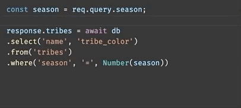
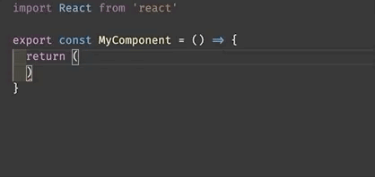
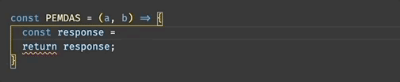
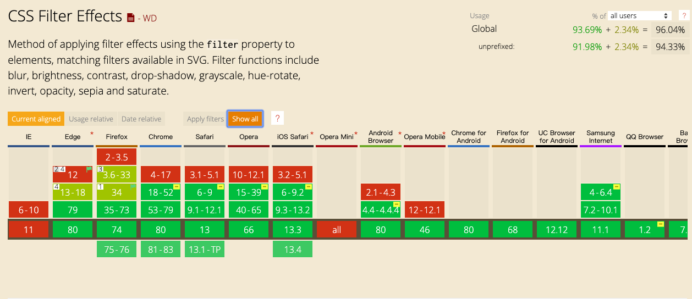
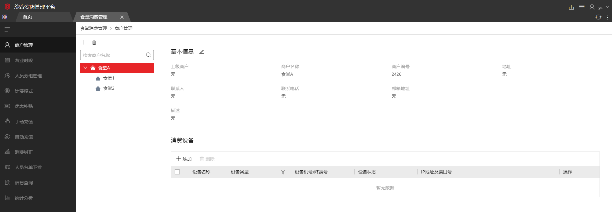

## 工具

### 你项目中没有安装的 VS Code 插件（实用）

#### javascript console utils



按住快捷键 ctrl + shift + L(windows)、cmd + shift + L 即可出现一个带变量名的 console.log。

#### indent rainbow



通过颜色区分缩进，再也不担心犯强迫症。

#### bracket pair colorizer



用不同颜色的标注帮助区分多个括号,花括号的起始位置。

### Pont - 搭建前后端之桥

Pont 把 swagger、rap、dip 等多种接口文档平台（目前支持 swagger)，转换成 Pont 元数据。Pont 利用接口元数据，可以高度定制化生成前端接口层代码，接口 mock 平台和接口测试平台。

在日常开发过程中，我们经常会遇到这样一个问题，后端写好了接口文档，过段时间，发现页面上的字段值不见了，一检查，原来是后端悄悄改了参数名。这可真是气人啊。现在，使用 pont 后，只需要在 vscode 下载 pont 插件，全局安装 pont-engine 库，就可以通过检测后端接口参数的改动信息。

[仓库地址](https://github.com/alibaba/pont)

### 文章

#### 清明节时，是如何实现网站灰色效果

清明节，国家举行了祭奠仪式，我们打开常用的 app,网站时，看到的是灰色的主题。
当时我第一眼看到，觉得应该是控制了主题色，通过样式变量来对全局的组件进行颜色的设置。后来发现实现其实更加简单。

我们打开一个网站，先看看正常的效果：


然后再来看看灰色效果：


是不是觉得很有意思。

我们来看看是怎么回事。

##### filter css 属性

filter CSS 属性将模糊或颜色偏移等图形效果应用于元素。滤镜通常用于调整图像，背景和边框的渲染。

CSS 标准里包含了一些已实现预定义效果的函数。你也可以参考一个 SVG 滤镜，通过一个 URL 链接到 SVG 滤镜元素 (SVG filter element[https://developer.mozilla.org/en-US/docs/Web/SVG/Element/filter])。

这里实现灰色滤镜效果的方法就是 filter: grayscale()。

将图像转换为灰度图像。值定义转换的比例。percent 值为 100% 则完全转为灰度图像，值为 0% 图像无变化。值在 0% 到 100% 之间，则是效果的线性乘子。若未设置，值默认是 0。另外除了传递百分比，还可以传递浮点数，效果是一样的。

如：

filter: grayscale(1)
filter: grayscale(100%)

所以到这里我们想要把全站变成灰色，再考虑到各浏览器兼容写法：

```
.gray {
    -webkit-filter: grayscale(100%);
    -moz-filter: grayscale(100%);
    -ms-filter: grayscale(100%);
    -o-filter: grayscale(100%);
    filter: grayscale(100%);
    filter: progid:DXImageTransform.Microsoft.BasicImage(grayscale=1);
}
```

最后看一下浏览器的兼容性：



可以看到，除了 ie 外，其他的 PC、手机端的浏览器都支持了，Firefox 的 PC、安卓端还单独对 SVG 图像加了支持，可以放心使用。

## 文章

### 微前端架构的尝试

#### 什么是微前端

微前端指可以容纳不同业务系统的容器，而这个容器内的子系统，可以使用任意技术栈。

比如：ISC



#### 优点

独立开发、独立部署，功能解耦、不同的技术栈...

#### 方案

常见的，也是处理成本最低的一种方案是 iframe。另一种就是接下去要讲解的单页应用方案。

#### 实现
